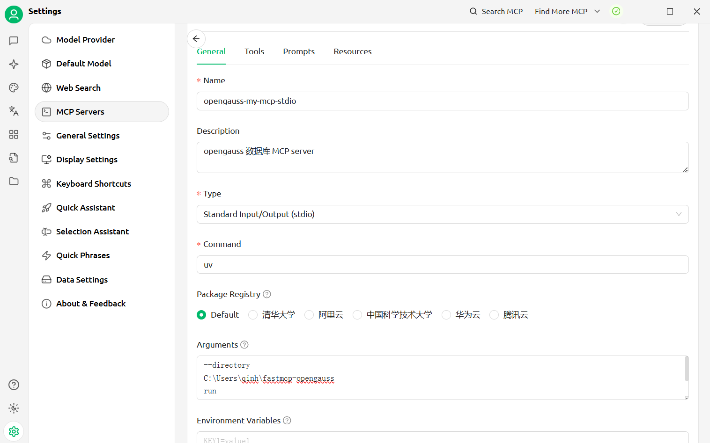
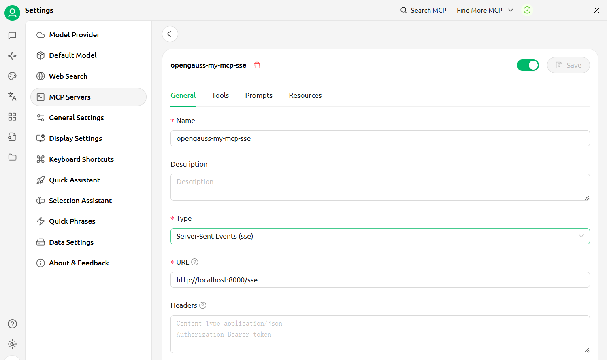
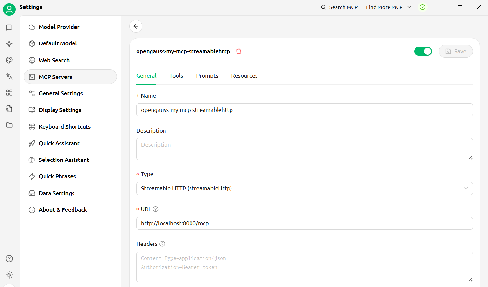

# Model Context Protocol Server for openGauss

## Features

- Build with FastMCP 2.0 .
- Support Stdio, SSE and Streamable-Http transporting method.
- MCP server transporting method, listerning port, host and path are Configurable via command-line argument.
- openGauss connection parameters are configurable via environment variables or .env files.

## Deployment

Note: uv and python >= 3.12 is required.

```shell
git clone https://github.com/HowardQin/fastmcp-opengauss.git
cd fastmcp-opengauss
cp .env.example .env
uv sync
```

openGauss connection parameters are loaded from .env, for example:
```shell
OPENGAUSS_HOST=172.32.148.228
OPENGAUSS_PORT=31001
OPENGAUSS_USER=app
OPENGAUSS_PASSWORD=Postgres1234
OPENGAUSS_DBNAME=app
```
These parameters can be overwriten if identical environment variables are set.


## Usage with Claude Desktop
Claude Desktop only supports Stdio mode, so we add the Stdio starting command in claude_desktop_config.json:
```json
{
    "mcpServers": {
        "openGauss": {
            "command": "uv",
            "args": [
                "--directory",
                "C:\\Users\\qinh\\fastmcp-opengauss",
                "run",
                "server.py",
                "--transport",
                "stdio"
            ]
        }
    }
}
```


## Usage with CherryStudio
CherryStudio supports all three transporting mode: Stdio, SSE and Streamable-Http
### Stdio:

Arguments:
```shell
--directory
C:\Users\qinh\fastmcp-opengauss
run
server.py
--transport=stdio
```

### SSE:
For SSE transport mode, we need to start a standalone mcp server, run following command in project root directory, or in any directory with --directory specifing project root dir :
```shell
uv --directory C:\Users\qinh\fastmcp-opengauss run .\server.py --transport=sse --port=8000 --path=/sse --host=0.0.0.0
```
Then configure CherryStudio to connect sse mcp server:



### Streamable-Http:
For Streamable-Http, we need to start a standalone mcp server, run following command in project root directory, or in any directory with --directory specifing project root dir:
```shell
uv --directory C:\Users\qinh\fastmcp-opengauss run .\server.py --transport=streamable-http --port=8000 --path=/mcp --host=0.0.0.0
```


